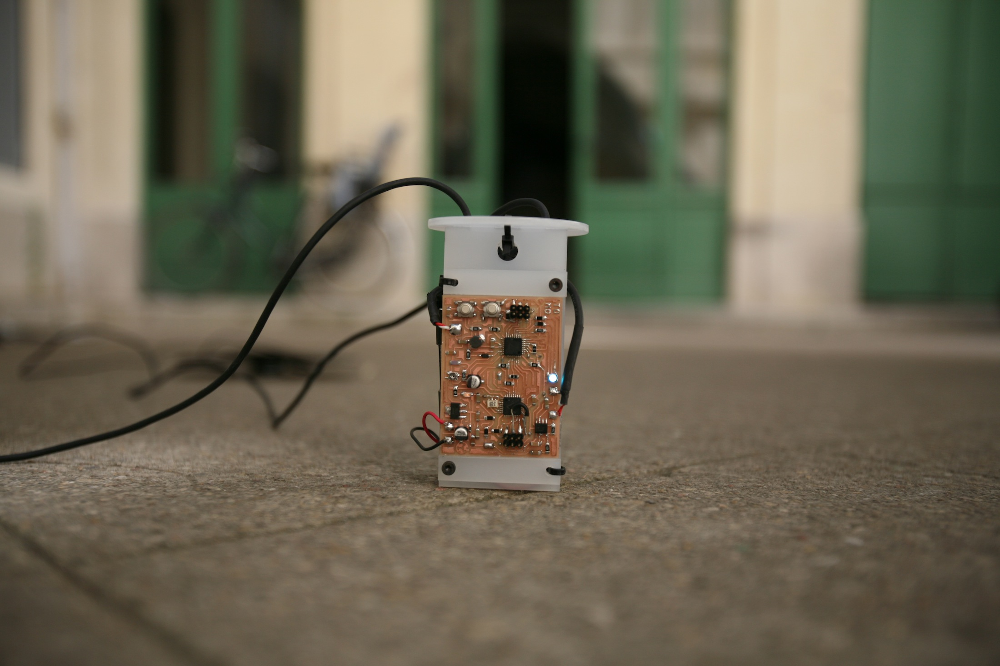

#### TOMO is a programmable Touch Synthesizer board based on Arduino. 

##### TOMO can sense your touch on many different materials and create sounds to tell people things.

### What is TOMO?

##TO

**TO** means touch. Tomo uses **Swept Frequency Capacitive Sensing (SFCS)** a concept explored by [Disney Research Labs](http://www.disneyresearch.com/) on this [paper](http://www.disneyresearch.com/wp-content/uploads/touchechi2012.pdf). The Arduino implementation is based on the documentation by [ILLUTRON](http://illutron.dk/Instructable-Use-Any-Surface-as-a-Touch-Interface-with-Arduino) and developed by [Cleniem](https://github.com/clemniem). The internal ongoing research on SFCS can be found at [fablabbcn/TouchE](https://github.com/fablabbcn/TouchE).

##MO

**MO** means [Mozzi](http://sensorium.github.io/Mozzi/) an amazing library for sound synthesis library for Arduino developed by [Tim Barrass](http://www.reverberant.com/pp/barrass.htm). This means you can create sounds with it from simple tones to delays and echos. We will soon add *.WAV palying functionality too.

### How is TOMO?

* Small
* Portable
* Easy
* Fun
* and it runs on batteries for a week!

### Project team:

This project was developed with the support of the [EASTN (The European Art-Science-Technology Network)](https://github.com/eastn.eu) at [Fab Lab Barcelona](http://www.fablabbcn.org/). The first real setup was done for the [FAV Festival](http://festivaldesarchitecturesvives.com/) in Monpellier in June 2014.

* [Cleniem](https://github.com/clemniem) 
* [Pral2a](https://github.com/pral2s)
* [Anastasia Pistofidou](https://github.com/anastasiafab)

